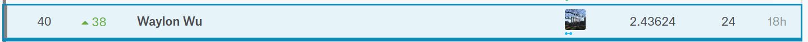

# LANL Earthquake Prediction

This is the repository for the Kaggle competition: 

<https://www.kaggle.com/c/LANL-Earthquake-Prediction/overview>

I got 40th out of 4541 teams (top 1%)

The model I used is:
random forest/knn/extra tree/ada boost/Nu SVR/light gbm/xgboost/cat boost - 8 models
light gbm/xgboost/cat boost - to do stacking on above 8 models
light gbm stacking on above 3 models